# LLMs from Scratch

从零开始学习和实现大语言模型。

## 🚀 快速开始

### 安装依赖

```bash
# 创建虚拟环境
uv venv --python=python3.11 

# 激活虚拟环境
source .venv/bin/activate

# 安装依赖
pip install -r requirements.txt
```

## 📂 项目进度

**项目整体目标流程图：**


### Ch02：文本数据处理 (Working with Text Data)

- ✅ `simpleTokenizer.py` - 简单分词器实现
- ✅ `tokenizer.py` - GPT2分词器测试
- ✅ `dataLoader.py` - PyTorch数据加载器
- ✅ `embedding.py` - 文本嵌入示例
- ✅ `text-prepare.py` - 文本预处理
- ✅ `test.py` - 基础测试

**Token嵌入层 (Embedding Layer)：**

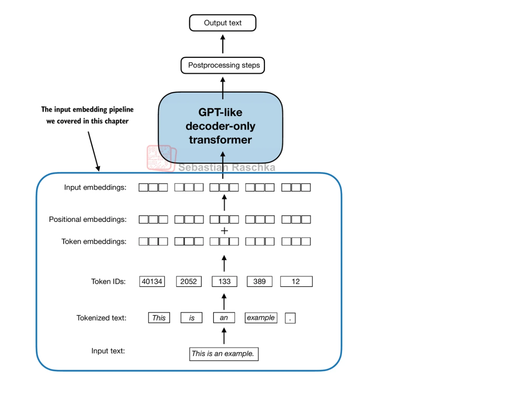

### Ch03：注意力机制 (Coding Attention Mechanisms)

**注意力机制基础概念：**

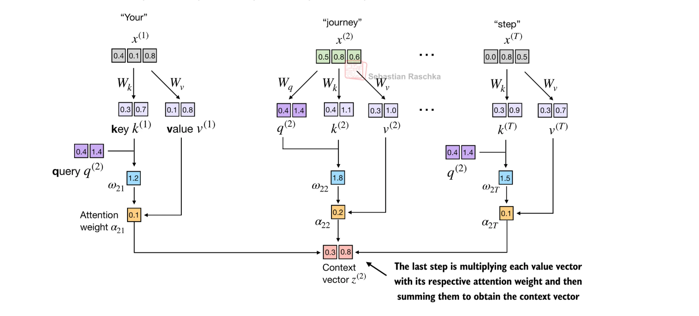

**因果注意力机制 (Causal Attention) 流程：**

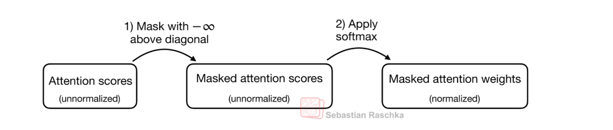

**多头注意力机制 (Multi-Head Attention)：**

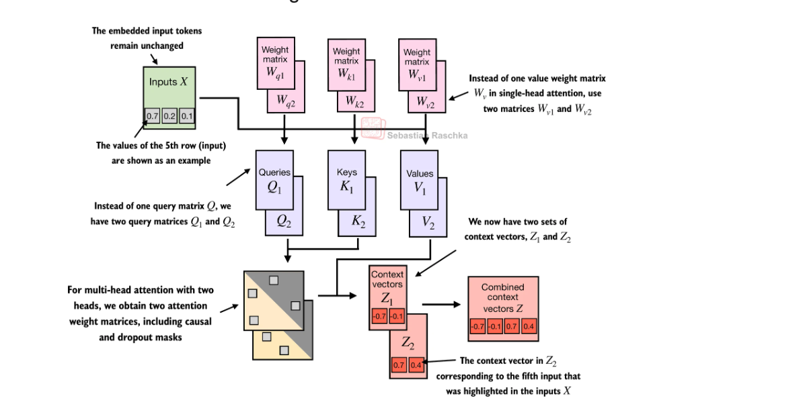

- ✅ `simpleSelfAttention.py` - 简单自注意力机制
- ✅ `causalAttention.py` - 因果注意力实现
- ✅ `multiHeadAttention.py` - 多头注意力机制

### Ch04：实现GPT模型 (Implementing GPT Model)

- ✅ `gptModel.py` - GPT模型架构实现

**GPT模型整体架构：**

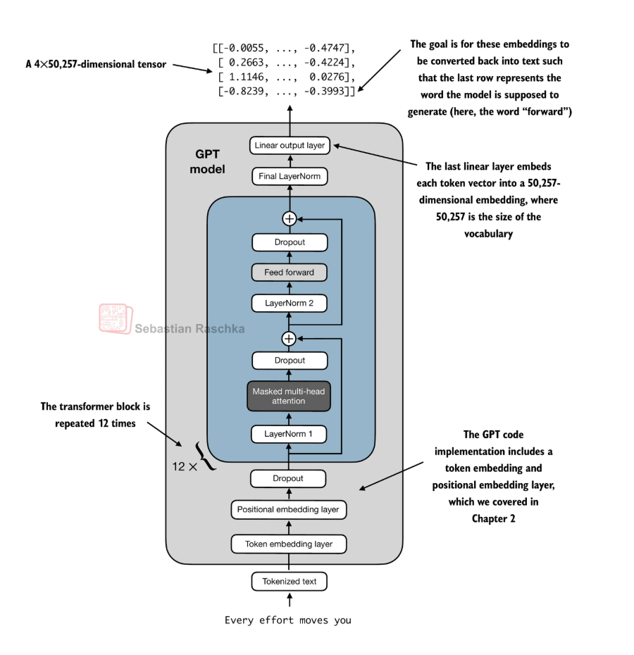

**Transformer Block内部结构：**

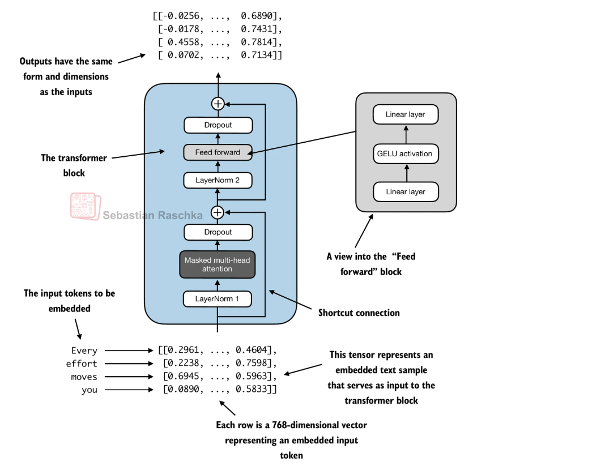

- ✅ `previous_chapters.py` - 前面章节的集成

### Ch05：无标签数据预训练 (Pretraining on Unlabeled Data)

- ✅ `previous_chapters.py` - 前四章代码集成优化
- ✅ `generate_test.py` - 文本生成测试
- ✅ `loss_calc.py` - 损失函数计算
- ✅ `loss_test.py` - 损失函数测试
- ✅ `gpt_download.py` - GPT模型下载工具
- ✅ `pretraining.py` - 预训练主程序
- ✅ `load.py` - 模型加载工具
- ✅ `temperature_scaling_and_top-k.py` - 文本生成策略优化

**预训练目标：**

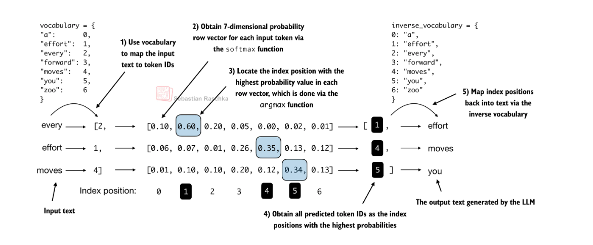

**损失函数计算详解：**

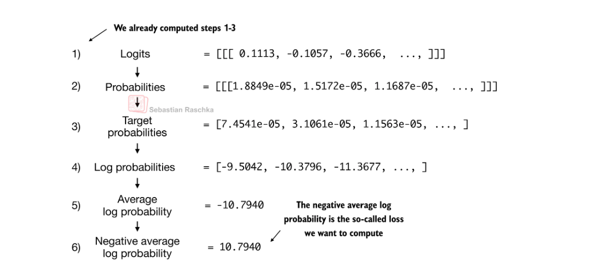

**预训练流程详解：**


**Top-k采样策略示例：**

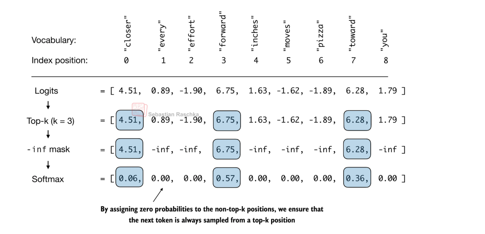

### Ch06：文本分类微调 (Finetuning for Text Classification)

**项目目标：** 基于预训练的GPT-2模型，使用SMS垃圾短信数据集进行文本分类微调

**文本分类微调工作流程：**

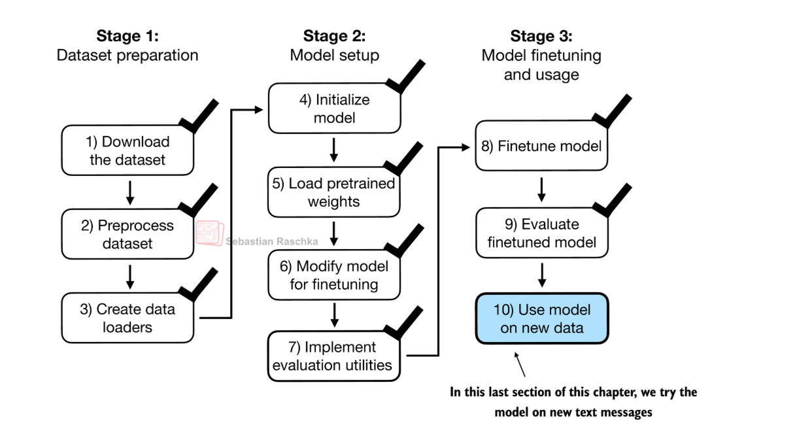

该流程图展示了从数据准备到模型推理的完整微调过程，包括数据处理、模型初始化、参数冻结、微调训练和最终分类等关键步骤。

#### 6.2 数据准备 (Preparing the dataset)

- ✅ 下载并解析SMS垃圾短信数据集
- ✅ 类别平衡：欠采样多数类（ham）以匹配少数类（spam）数量
- ✅ 类别编码：将字符串标签映射为整数（ham: 0, spam: 1）
- ✅ 数据分割：70% 训练集、10% 验证集、20% 测试集

#### 6.3 数据加载器 (Creating data loaders)

- ✅ `SpamDataset` 类实现：
  - 文本分词和编码
  - 动态最大长度计算
  - 填充到统一长度
- ✅ DataLoader 配置（batch_size=8, shuffle=True）
- ✅ 数据验证（输入维度: [batch_size, sequence_length]，标签维度: [batch_size]）

**数据集处理流程：**

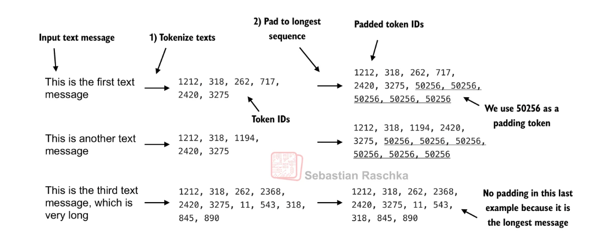

**数据加载器验证：**

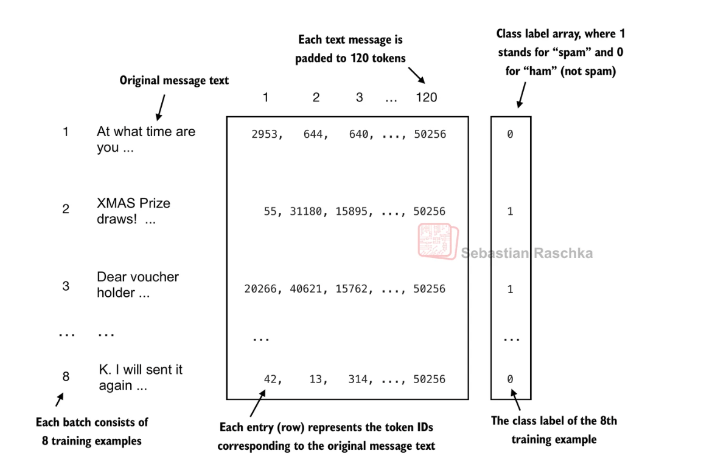

#### 6.4 模型初始化 (Initializing a model with pretrained weights)

- ✅ 加载预训练GPT-2小模型（124M参数）
- ✅ 权重加载验证：生成文本测试
- ✅ 关键修复：添加 `model.eval()` 确保LayerNorm使用运行时统计

**GPT-2模型配置：**

- vocab_size: 50257
- context_length: 1024
- emb_dim: 768
- n_layers: 12
- n_heads: 12

#### 6.5 分类头添加 (Adding a classification head)

- ✅ 冻结所有预训练参数：`param.requires_grad = False`
- ✅ 替换输出层为分类层：`Linear(emb_dim=768, num_classes=2)`
- ✅ 解冻最后一层和LayerNorm：允许微调

**转移学习策略：** 冻结大部分参数，仅微调最后的transformer块和分类头，这样既能利用预训练知识，又能快速适应新任务

**分类头架构：**

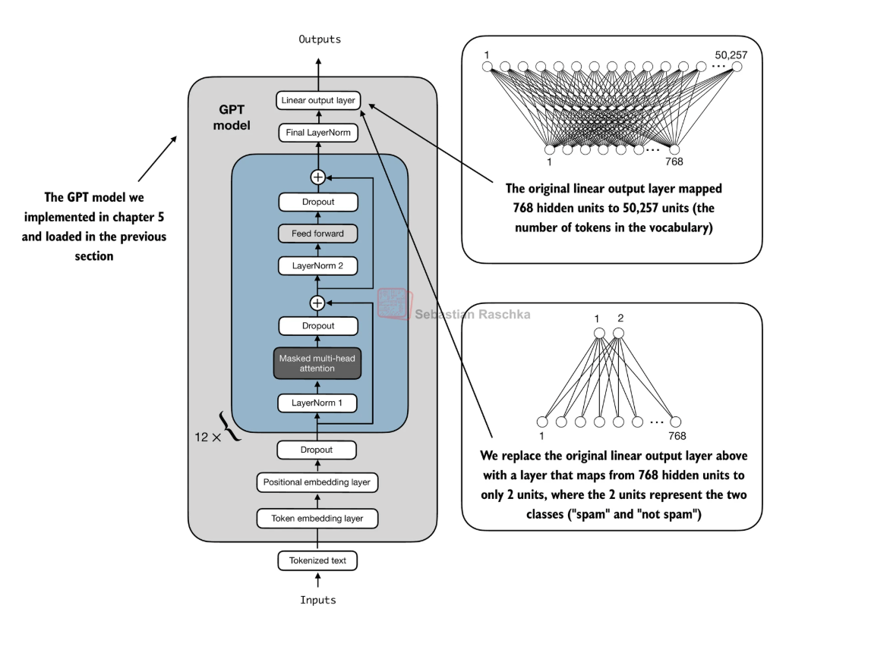

该图展示了GPT-2模型经过冻结参数和添加分类头后的结构，（最后一层transformer块和分类头）可参与梯度更新

#### 6.6 损失和精度计算 (Calculating loss and accuracy)

- ✅ `calc_accuracy_loader()`：计算分类精度

  - 使用最后一个token的logits
  - 通过argmax获取预测标签
  - 对比target计算正确率
- ✅ `calc_loss_batch()`：计算单个batch的交叉熵损失
- ✅ `calc_loss_loader()`：计算整个data loader的平均损失

**损失和精度计算结果：**

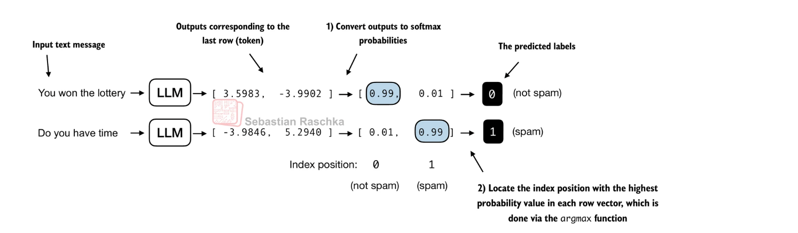

#### 6.7 模型微调 (Finetuning on supervised data)

- ✅ `train_classifier_simple()`：完整的训练循环实现

  - 支持自定义epoch数、评估频率、评估迭代次数
  - 返回训练/验证损失和精度曲线
  - 每个epoch后显示精度统计
- ✅ `evaluate_model()`：评估阶段的模型切换

  - 在评估时切换到eval模式（禁用dropout和BatchNorm更新）
  - 评估后重新切换回train模式
- ✅ 优化器配置：`AdamW`（权重衰减0.1，学习率5e-5）
- ✅ 训练配置：5个epoch，每50步评估一次

**训练循环详细流程：**

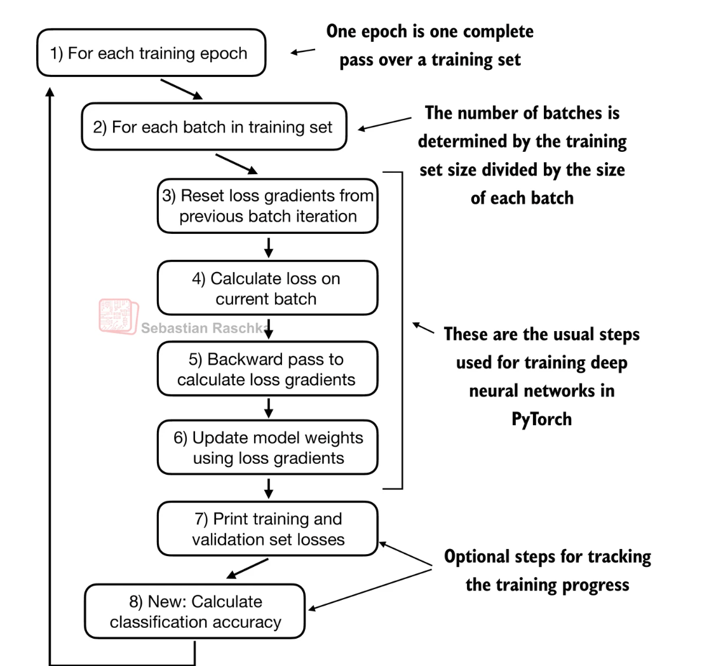

上图展示了完整的训练流程：

1. **初始化阶段**：设置模型、优化器、epoch数等
2. **训练循环**：对每个epoch进行以下操作
   - 将模型设置为train模式
   - 遍历所有batch数据
   - 计算loss → 反向传播 → 优化器更新
   - 定期进行验证评估
3. **评估阶段**：在验证集上评估当前模型性能
4. **统计输出**：每个epoch后打印训练/验证精度

**训练结果汇总：**

- 最终训练精度：~97-99%（模型充分学习训练数据特征）
- 最终验证精度：~93-95%（在未见数据上的泛化能力）
- 最终测试精度：~92-94%（最终模型评估指标）

#### 6.8 使用微调模型进行分类 (Using the LLM as a spam classifier)

- ✅ `classify_review()`：单条文本分类函数

  - **输入**：任意长度的文本字符串
  - **处理流程**：
    1. 文本分词和编码
    2. 截断或填充至指定长度
    3. 转换为tensor并推送到设备
    4. 提取最后token的logits
    5. argmax确定预测类别
  - **输出**："spam" 或 "not spam"

### Ch07：指令微调 (Finetuning to Follow Instructions)

**项目目标：** 基于预训练的GPT-2中型模型，使用指令数据集进行有监督微调，使模型能够遵循用户指令

**指令微调的完整流程：**

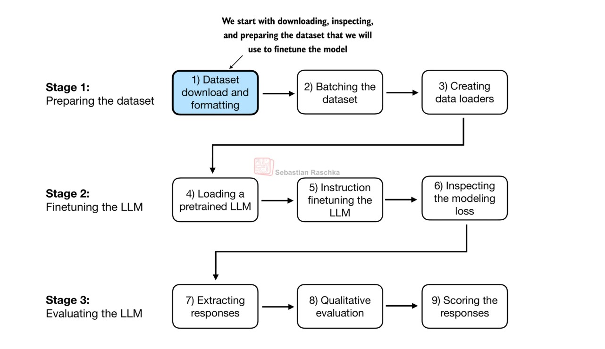

该流程图展示了从数据准备、模型加载、参数冻结、到模型微调和评估的完整指令微调过程。

#### 7.2 准备指令微调数据集 (Preparing a dataset for supervised instruction finetuning)

- ✅ 下载并加载指令数据集（alpaca-like format）
- ✅ 数据格式处理：包含instruction、input和output三个字段
- ✅ 文本格式化：按照标准模板组织instruction、input和response
- ✅ 数据分割：85% 训练集、10% 测试集、5% 验证集

**指令数据格式示例：**

```
Below is an instruction that describes a task. Write a response that appropriately completes the request.

### Instruction:
[用户的指令]

### Input:
[可选的输入数据]

### Response:
[期望的模型输出]
```

#### 7.3 组织数据成训练批次 (Organizing data into training batches)

**数据集结构与批处理流程：**


该图展示了指令数据集的基本结构，包含instruction、input和output三个关键字段。

**Batch处理中的目标标记策略：**

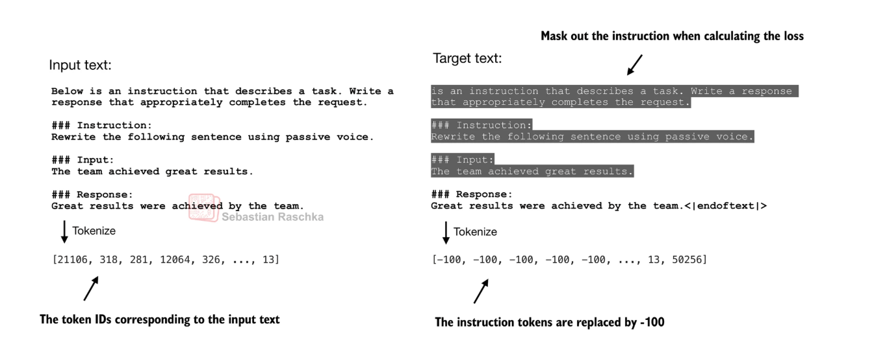

该图说明了在批处理中如何标记目标张量：仅对response部分计算loss，instruction和padding部分被设置为ignore_index（-100），这样模型只学习生成正确的response，而不对instruction部分进行优化。

- ✅ `InstructionDataset` 类实现：
  - 加载指令数据集
  - 文本分词和编码
  - 动态最大长度计算
- ✅ `custom_collate_fn` 实现：
  - 自定义填充策略（pad_token_id = 50256）
  - 为instruction部分（非response部分）的padding token设置ignore_index = -100
  - 限制最大长度为1024 tokens
  - 返回输入和目标张量对

#### 7.4 创建数据加载器 (Creating data loaders for an instruction dataset)

- ✅ 设备检测：支持CUDA、MPS或CPU
- ✅ 训练/验证/测试数据加载器配置：
  - batch_size: 8
  - 训练集：shuffle=True, drop_last=True
  - 验证/测试集：shuffle=False, drop_last=False
- ✅ 数据验证（inputs和targets维度匹配）

#### 7.5 加载预训练模型 (Loading a pretrained LLM)

- ✅ 加载预训练GPT-2中型模型（355M参数）
- ✅ 模型配置选项：

  - GPT-2 Small (124M)
  - GPT-2 Medium (355M) ← 本实验使用
  - GPT-2 Large (774M)
  - GPT-2 XL (1558M)

**GPT-2中型模型配置：**

- vocab_size: 50257
- context_length: 1024
- emb_dim: 1024
- n_layers: 24
- n_heads: 16

#### 7.6 在指令数据上微调模型 (Finetuning the LLM on instruction data)

- ✅ `train_model_simple()`：完整的微调训练循环

  - 支持自定义epoch数、评估频率、评估迭代次数
  - 定期在验证集上评估模型性能
  - 返回训练/验证损失和token计数
  - 支持生成示例输出进行定性评估

#### 7.7 提取和保存响应 (Extracting and saving responses)

- ✅ 在测试集上生成模型响应：

  - 使用微调后的模型进行推理
  - 生成max_new_tokens=256的输出
  - 清理response文本（移除模板部分）
- ✅ 响应保存：将测试数据和模型生成的响应保存为JSON文件
- ✅ 模型保存：将微调后的模型权重保存为 `.pth`文件

#### 7.8 评估微调模型 (Evaluating the finetuned LLM)

- ✅ 使用Ollama运行本地LLM进行评分：

  - 集成Llama3作为评判模型
  - 为每个模型响应生成0-100的评分
- ✅ 评分过程：

  - 对每条测试样本生成模型响应
  - 使用Llama3对比正确答案和模型答案
  - 计算平均评分
- ✅ 评估指标：

  - 个体样本评分：0-100分
  - 整体平均评分：汇总所有测试样本的评分
  - 定性评估：逐条对比正确答案和模型答案

---

### Ch07-DPO：偏好优化 (Preference Tuning with DPO)

**项目目标：** 使用Direct Preference Optimization (DPO)方法，基于人类偏好数据对已微调的模型进行进一步优化

**DPO优化流程概览：**

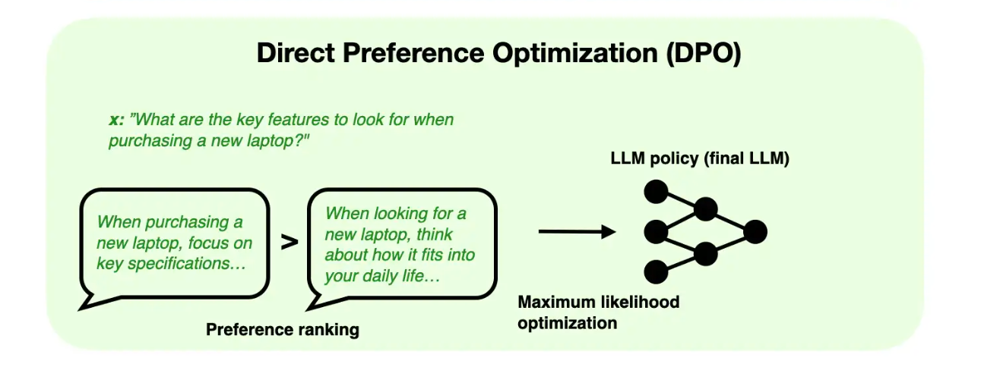

该流程图展示了DPO方法的核心过程：使用偏好数据集（包含chosen和rejected响应）训练策略模型，同时使用参考模型提供基准，通过优化相对概率来对齐人类偏好。

#### 1. 准备DPO偏好数据集 (Preparing a preference dataset for DPO)

- ✅ 下载并加载偏好数据集（包含chosen和rejected响应）
- ✅ 数据格式：包含instruction、input、output、chosen和rejected五个字段
  - `chosen`：人类偏好的响应
  - `rejected`：人类不偏好的响应
- ✅ 数据分割：85% 训练集、10% 测试集、5% 验证集

**偏好数据集结构：**

```json
{
  "instruction": "用户指令",
  "input": "可选输入",
  "output": "标准输出",
  "chosen": "偏好响应（更好的回答）",
  "rejected": "非偏好响应（较差的回答）"
}
```

#### 2. 创建偏好数据加载器 (Creating preference data loaders)

- ✅ `PreferenceDataset` 类实现：

  - 分别编码prompt、chosen和rejected响应
  - 存储三种token序列供训练使用
- ✅ `custom_collate_fn` 实现：

  - 为chosen和rejected响应分别创建mask
  - `mask_prompt_tokens=True`：仅对response部分计算loss
  - 动态padding到batch内最大长度
  - 返回包含prompt、chosen、rejected及对应mask的字典
- ✅ 数据验证：

  - 检查mask正确标记了response部分
  - 验证padding token被正确处理

#### 3. 加载策略模型和参考模型 (Loading policy and reference models)

- ✅ Policy Model（策略模型）：

  - 加载Ch07微调后的模型权重
  - 训练过程中参数会被更新
  - 用于生成最终的响应
- ✅ Reference Model（参考模型）：

  - 加载相同的Ch07微调后的模型权重
  - 参数保持冻结，不参与训练
  - 用于计算KL散度，防止策略模型偏离太远

**策略模型与参考模型的协同机制：**

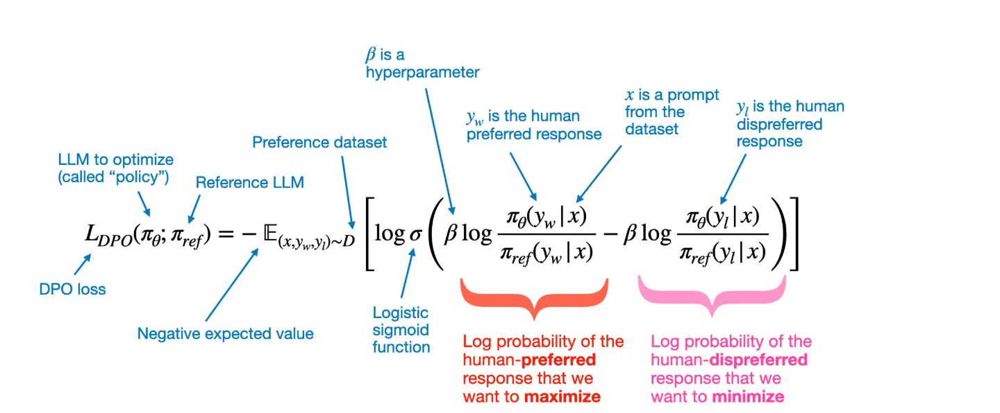

该图说明了DPO训练中策略模型和参考模型的关系：策略模型负责学习并生成更符合人类偏好的响应，而参考模型作为固定基准，确保策略模型不会过度偏离原始的指令遵循能力。两者共同计算DPO损失，实现偏好对齐。

#### 4. 实现DPO损失函数 (Implementing DPO loss functions)

- ✅ `compute_logprobs()`：计算对数概率

  - 使用log_softmax获取token的对数概率
  - 通过torch.gather选择对应label的概率
  - 使用mask仅对response部分计算平均概率
- ✅ `compute_dpo_loss()`：核心DPO损失计算

  - 计算策略模型的log ratio：chosen vs rejected
  - 计算参考模型的log ratio：chosen vs rejected
  - 损失函数：`-log_sigmoid(β * (model_logratios - ref_logratios))`
  - 返回损失、chosen奖励和rejected奖励

**DPO损失公式核心思想：**

- 最大化chosen响应相对于rejected响应的概率比
- 使用参考模型作为基准，避免过度优化
- β参数控制优化强度（本实验使用0.1）

#### 5. DPO模型训练 (Training with DPO)

- ✅ `train_model_dpo_simple()`：DPO训练循环

  - 在每个batch上计算DPO损失
  - 同时跟踪chosen和rejected的奖励边际
  - 定期评估训练和验证的损失及奖励
  - 生成示例输出进行定性评估
- ✅ 训练配置：

  - 优化器：AdamW（lr=5e-6, weight_decay=0.01）
  - Epochs：1
  - Beta：0.1
  - 评估频率：每5步
- ✅ 关键指标：

  - **训练/验证损失**：DPO损失值
  - **Reward Margin**：chosen_reward - rejected_reward
  - 更高的reward margin表示模型更好地区分偏好

#### 6. 模型评估与对比 (Evaluation and comparison)

- ✅ 对比三种输出：

  - **正确答案**：数据集中的标准输出
  - **Reference Model**：SFT微调后的基础模型
  - **Policy Model**：DPO优化后的模型
- ✅ 评估维度：

  - 响应质量：是否更符合人类偏好
  - 响应风格：是否更加准确和有帮助
  - 对比分析：DPO前后的改进
- ✅ 损失曲线可视化：

  - 绘制训练/验证损失随epoch变化
  - 观察模型收敛情况

**DPO优势总结：**

- ✅ 无需显式奖励模型
- ✅ 训练更稳定（相比RLHF）
- ✅ 计算效率更高
- ✅ 直接优化策略模型以匹配人类偏好

---

### Appendix D：训练循环优化技巧 (Adding Bells and Whistles to the Training Loop)

**项目目标：** 为GPT模型的训练循环添加高级优化技术，包括学习率调度、梯度裁剪等，以提升训练稳定性和模型性能

#### D.1 学习率预热 (Learning rate warmup)

- ✅ 实现线性学习率预热策略

  - 从初始学习率（initial_lr）逐步增长到峰值学习率（peak_lr）
  - 预热步数（warmup_steps）通常设置为总训练步数的10-20%
  - 避免训练初期学习率过高导致的不稳定
- ✅ 学习率预热的作用：

  - **防止早期梯度爆炸**：模型参数初始化时，大学习率可能导致梯度不稳定
  - **提升训练稳定性**：平滑的学习率增长使模型逐步适应训练数据
  - **改善最终性能**：更稳定的训练过程通常能达到更好的收敛点

**实现公式：**

```
if global_step < warmup_steps:
    lr = initial_lr + (peak_lr - initial_lr) * (global_step / warmup_steps)
```

#### D.2 余弦衰减调度 (Cosine decay)

- ✅ 实现余弦衰减学习率调度策略

  - 预热阶段后，学习率按余弦曲线从峰值衰减到最小值
  - 提供平滑的学习率下降，避免突然的跳变
  - 最小学习率（min_lr）通常设置为峰值学习率的10%
- ✅ 余弦衰减的优势：

  - **平滑衰减**：避免阶梯式学习率下降带来的训练波动
  - **更好的收敛**：逐渐降低的学习率有助于模型精细调整参数
  - **广泛应用**：在大规模语言模型训练中的标准做法

**实现公式：**

```
progress = (global_step - warmup_steps) / (total_steps - warmup_steps)
lr = min_lr + (peak_lr - min_lr) * 0.5 * (1 + cos(π * progress))
```

**学习率曲线特点：**

- 前期：线性预热（0 → peak_lr）
- 中期：缓慢衰减（保持较高学习率）
- 后期：快速衰减（逼近min_lr）

**学习率调度可视化：**

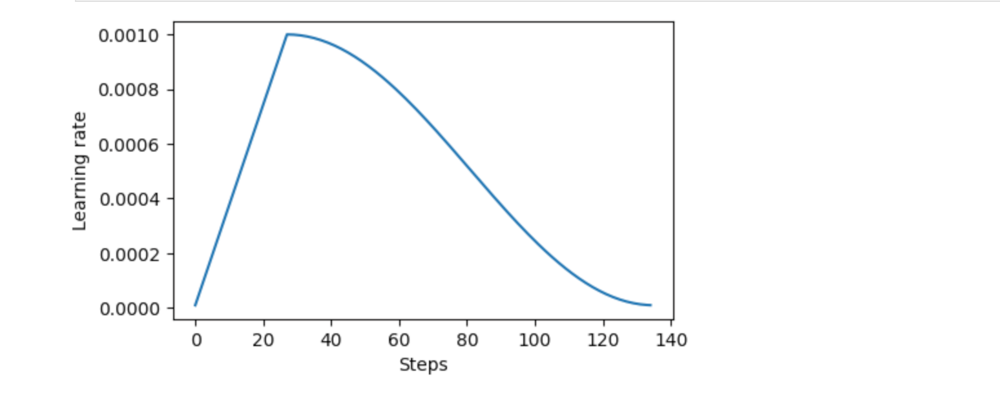

该图展示了完整的学习率调度曲线：起始阶段进行线性预热，随后按照余弦函数平滑衰减至最小学习率。这种调度策略结合了预热的稳定性和余弦衰减的收敛优势，是现代大型语言模型训练的标准配置。

#### D.3 梯度裁剪 (Gradient clipping)

- ✅ 实现梯度范数裁剪（Gradient Norm Clipping）

  - 限制梯度的L2范数不超过设定阈值（通常为1.0）
  - 防止梯度爆炸导致的训练崩溃
  - 在预热阶段结束后开始应用
- ✅ 梯度裁剪的必要性：

  - **防止梯度爆炸**：Transformer模型训练中常见问题
  - **稳定训练**：特别是在使用较大学习率时
  - **保持梯度方向**：只缩放梯度大小，不改变方向

**实现方式：**

```python
if global_step >= warmup_steps:
    torch.nn.utils.clip_grad_norm_(model.parameters(), max_norm=1.0)
```

**关键参数：**

- `max_norm=1.0`：梯度范数的最大值
- 仅在预热后应用，避免影响预热阶段的学习率调整

#### D.4 改进的训练函数 (The modified training function)

- ✅ `train_model()` 整合所有优化技术：

  - 学习率预热 + 余弦衰减调度
  - 梯度裁剪（在预热后应用）
  - 定期评估与样本生成
  - 损失和学习率跟踪
- ✅ 函数参数配置：

  - `n_epochs`：训练轮数（15轮）
  - `warmup_steps`：预热步数
  - `initial_lr`：初始学习率（1e-5）
  - `peak_lr`：峰值学习率（0.001）
  - `min_lr`：最小学习率（1e-5）
  - `weight_decay`：权重衰减（0.1）
- ✅ 训练过程监控：

  - **损失曲线**：训练/验证损失随步数变化
  - **学习率曲线**：可视化学习率调度策略
  - **生成样本**：每个epoch后生成文本评估模型质量
  - **梯度统计**：监控最大梯度值，确认裁剪效果

**完整训练流程：**

1. **初始化阶段**：设置优化器、学习率参数、总训练步数
2. **训练循环**：
   - 每步动态调整学习率（预热或余弦衰减）
   - 计算损失并反向传播
   - 应用梯度裁剪（预热后）
   - 更新模型参数
3. **定期评估**：计算训练/验证损失
4. **文本生成**：每轮结束后生成样本

**优化效果对比：**

- ❌ 无优化：训练不稳定，容易发散
- ✅ 仅预热：改善初期稳定性
- ✅ 预热+余弦衰减：更好的收敛性能
- ✅ 完整优化：最稳定的训练过程和最佳性能

---

### Appendix E：LoRA参数高效微调 (Parameter-efficient Finetuning with LoRA)

**项目目标：** 使用LoRA (Low-Rank Adaptation) 技术进行参数高效微调，大幅减少可训练参数数量的同时保持模型性能

**LoRA技术原理概览：**

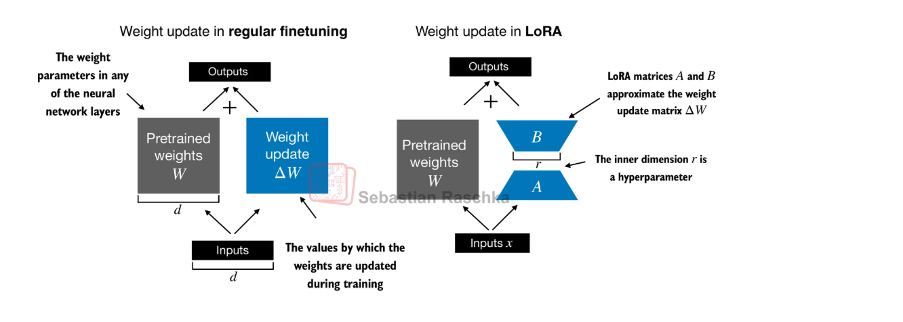

该图展示了LoRA的核心思想：通过低秩矩阵分解来近似权重更新。原始预训练权重W保持冻结，仅训练两个小矩阵A和B，其乘积ΔW=AB作为权重增量，从而实现参数高效的微调。

#### E.2 数据集准备 (Preparing the dataset)

- ✅ 使用SMS垃圾短信数据集
- ✅ 数据平衡和分割（70% 训练，10% 验证，20% 测试）
- ✅ 创建数据加载器（batch_size=8）

#### E.3 模型初始化 (Initializing the model)

- ✅ 加载预训练GPT-2小模型（124M参数）
- ✅ 添加分类头用于垃圾短信分类任务
- ✅ 初始基准测试（未微调）

#### E.4 使用LoRA进行参数高效微调 (Parameter-efficient finetuning with LoRA)

**LoRA层的具体实现：**

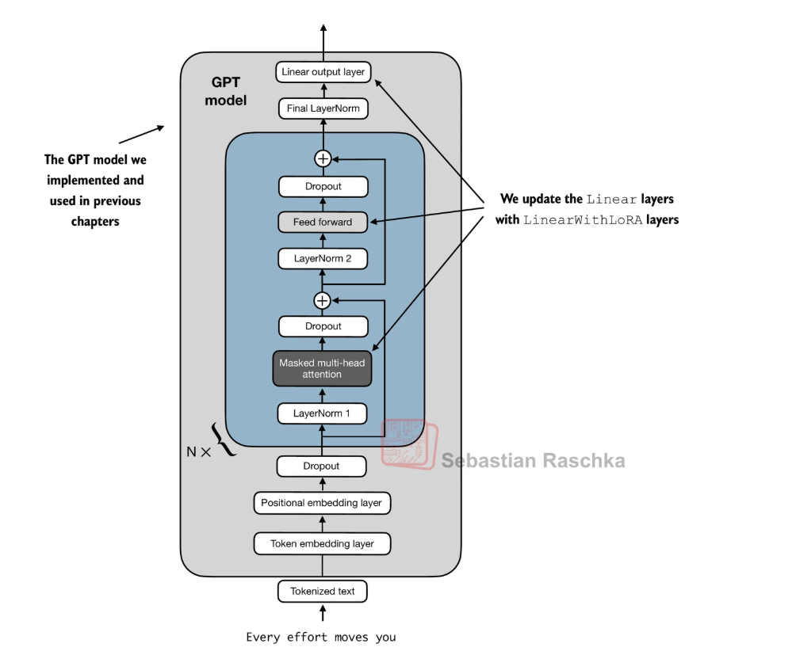

该图详细说明了LoRA层的实现方式：输入x通过原始冻结的Linear层得到Wx，同时通过LoRA路径得到(α/r)×xAB，两者相加得到最终输出。这种设计使得模型可以在不修改原始权重的情况下，通过训练少量参数来适应新任务。

- ✅ **LoRA核心原理**：

  - 将权重更新分解为低秩矩阵：ΔW = A × B
  - A: (in_dim, rank)，B: (rank, out_dim)
  - 原始权重保持冻结，仅训练A和B矩阵
- ✅ **实现细节**：

  - `LoRALayer`：实现低秩分解层
  - `LinearWithLoRA`：将原始Linear层与LoRA层组合
  - `replace_linear_with_lora()`：自动替换模型中所有Linear层
- ✅ **参数配置**：

  - rank=16：低秩矩阵的秩
  - alpha=16：缩放因子
  - 仅训练LoRA参数，冻结原模型参数
- **LoRA优势：**
- ✅ **参数效率**：相比全量微调减少99%+的可训练参数
- ✅ **内存节省**：显著降低GPU内存需求
- ✅ **训练速度**：更快的训练和更新速度
- ✅ **性能保持**：在大多数任务上达到接近全量微调的效果
- ✅ **模块化**：可轻松切换或组合不同的LoRA权重

**最终结果：**

- 训练准确率：~97-99%
- 验证准确率：~96-98%
- 测试准确率：~95-97%
- 与全量微调性能相当，但参数量大幅减少
